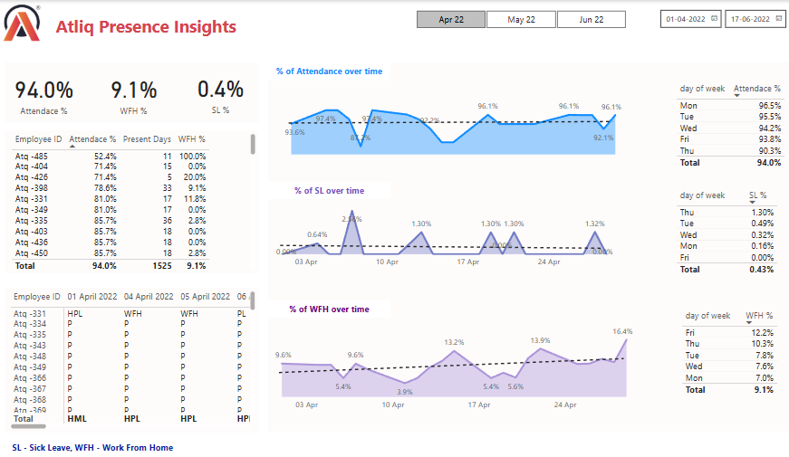

# HR Analytics Project - Atliq Technologies

Welcome to the HR Analytics Project repository for Atliq Technologies! This project focuses on analyzing attendance data from the past three months to provide actionable insights for the HR Generalist. By leveraging data extraction, transformation, and visualization techniques, we developed a comprehensive dashboard using Power BI Desktop.

---

## Problem Statement

Atliq Technologies’ HR Generalist needed insights from attendance data collected over the last three months. The objective was to:
- Identify attendance patterns.
- Develop employee retention strategies.
- Analyze reasons for sick leave percentages.
- Differentiate between Work From Home (WFH) and Work From Office (WFO) percentages.

---

## Data Source

The attendance data was provided in an Excel file. ETL (Extract, Transform, Load) processes were applied to clean and prepare the data for analysis.

---

## Steps Followed

### 1. **Understanding the Problem**
- Defined the analysis scope to focus on attendance trends, retention strategies, and sick leave percentages.

### 2. **Data Gathering and Transformation**
- Imported attendance data from the provided Excel file.
- Cleaned and transformed the data using ETL techniques.

### 3. **Creating Metrics with DAX**
- Used Data Analysis Expressions (DAX) to create essential metrics:
  - Attendance percentages.
  - Sick leave percentages.
  - WFH and WFO breakdowns.

### 4. **Dashboard Development**
- Built interactive dashboards in Power BI Desktop.
- Visualized attendance trends, sick leave reasons, and WFH vs. WFO distributions.

---

## How to Use the Dashboard

### Step 1: Download Power BI Desktop
- [Download Power BI Desktop](https://www.microsoft.com/en-us/download/details.aspx?id=58494) if not already installed.

### Step 2: Clone or Download the Repository
- Clone this repository to your local machine using Git or download it as a ZIP file.

### Step 3: Open the Power BI Project
- Open the `.pbix` file in Power BI Desktop. This file contains the pre-configured dashboard and data connections.

### Step 4: Explore the Dashboard
- Load the data and interact with the dashboard.
- Navigate through visualizations, filters, and slicers to uncover insights into attendance patterns and related metrics.

---

## Project Outcome

This analysis enables Atliq Technologies to make data-driven decisions for improving employee retention and satisfaction. By understanding:
- Attendance trends.
- Reasons behind sick leaves.
- The balance between WFH and WFO percentages.

The company can implement targeted strategies to enhance employee well-being.

---

## Acknowledgments

Special thanks to the Codebasics team for their invaluable tutorials and guidance during the development of this project. Check out their resources [here](https://www.youtube.com/watch?v=ru1qeDO_qrc&list=PLeo1K3hjS3uuVQccZa7yFwK3ltoGQOWbM).

---

## About

This project focuses on generating insights from three months of attendance data to assist the HR Generalist at Atliq Technologies.

### Topics
- HR Analytics
- Power BI
- ETL
- Data Visualization
